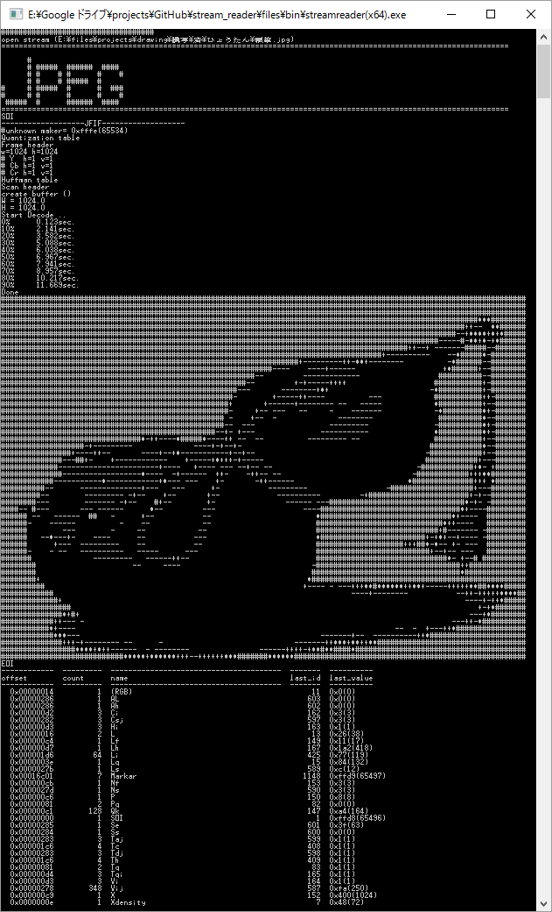

# BitStream Reader

各種バイナリをビット単位で解析し、情報表示やデコードをするツールです。
（現在の対応フォーマット: mp4, mpeg (ps, ts, tts, pes), h264/avc, h265/hevc, jpg(jfif, exif), iff(avi, wav, aiff), mp3(ID3tag), aac(adts), ac3, bmp など）

[もっと詳しく..](https://github.com/rflab/stream_reader/blob/master/README_detail.md)

## How to use

files/bin/streamreader.exeにファイルをドロップすると、自動的にファイルフォーマットが判別され解析が始まります。
解析が完了したらコンソール上の簡易コマンドで結果を参照することが可能です。
```
-- コマンド入力起動
>cmd()

-- とりあえず取得した値を全部見る
cmd>info

-- 名前に hoge を含む値の情報を表示
cmd>grep hoge
cmd>list hoge
cmd>view hoge
cmd>dump hoge

-- その他ヘルプ
cmd>help
```

